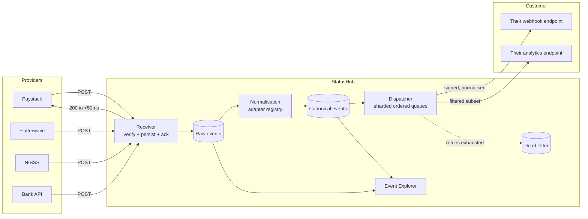

# StatusHub

### Universal Webhook Normaliser for Fintechs

**Repository:** `github.com/statushub/statushub` — standalone project, independent release cycle
**Stack:** Go 1.23, Postgres 16, Redis
**Document type:** Complete product specification — business analysis, product management, architecture, engineering, security, DevOps
**Version:** 1.0

---

## 1. What StatusHub is

**One line:** StatusHub is a single webhook receiver that sits in front of every payment provider a fintech uses — verifying each provider's signature, normalising wildly different payloads into one consistent schema, and forwarding them to the fintech's existing endpoint with retries, ordering and replay.

**Integration cost:** change one URL in each provider's dashboard. Nothing in the fintech's codebase changes, except deleting the per-provider parsing code they no longer need.

**The pitch in one sentence:** *point your providers at us instead of at yourself, and you will receive one payload shape forever, with retries and replay you did not have to build.*

### 1.1 Repository scope

Self-contained project with its own repository, versioning, release pipeline, dashboard and hosted deployment. It depends on no sibling product and nothing in this document lives outside this repository.

```
statushub/
├── cmd/
│   ├── statushub/            # server binary (receiver + dispatcher modes)
│   └── statushubctl/         # admin CLI
├── internal/
│   ├── receive/              # HTTP receiver, verify, persist, ack
│   ├── adapters/             # per-provider verification + parsing
│   │   ├── paystack/  flutterwave/  nibss/  monnify/
│   │   ├── interswitch/  stripe/
│   │   └── declarative/      # config-driven generic adapter
│   ├── normalise/            # canonical schema mapping
│   ├── dispatch/             # sharded ordered delivery, retries, DLQ
│   ├── audit/                # append-only trail, hash chain
│   ├── auth/                 # API keys, tenancy, receiver tokens
│   └── store/                # Postgres + Redis repositories
├── pkg/statushub/            # public Go SDK
├── sdk/
│   ├── node/                 # @statushub/node
│   └── python/               # statushub (PyPI)
├── dashboard/                # React SPA — event explorer
├── migrations/
├── deploy/{docker,helm,terraform}/
├── docs/adr/
└── .github/workflows/
```

---

## 2. Business analysis

### 2.1 The problem

A fintech of any size integrates three to five providers: Paystack, Flutterwave, NIBSS, one or two bank APIs, perhaps a card processor. Each delivers webhooks differently, and the differences are not cosmetic.

| Dimension | What varies across providers |
|---|---|
| Payload shape | Deeply nested versus flat; `data.status` versus `event.payment.state` versus `Status` |
| Amount units | Kobo, naira, decimal strings, integer minor units — sometimes inconsistently within one provider |
| Success value | `"success"`, `"successful"`, `"SUCCESS"`, `"00"`, `"completed"`, `true` |
| Signature scheme | HMAC-SHA512 over the raw body; HMAC-SHA256 over a concatenation of named fields; a shared secret in a header; IP allowlist only |
| Timestamps | ISO 8601 UTC; ISO with offset; Unix seconds; `"2026-08-11 09:14:22"` with an unstated timezone |
| Retry policy | Three attempts over ten minutes; ten attempts over 24 hours; none at all |
| Delivery guarantee | At-least-once; at-most-once; "usually" |

### 2.2 What this costs

| Cost | Detail |
|---|---|
| **Integration time** | Each new provider is one to two weeks of parsing, signature verification and testing against a sandbox that behaves differently from production |
| **Code rot** | The webhook handler becomes a 600-line switch on provider name that exactly one engineer understands, and that engineer eventually leaves |
| **Silent failure** | If the handler returns 500, some providers retry and some do not. Transactions get stuck in a state nobody notices until a customer complains. |
| **No replay** | Provider retries are exhausted long before an outage is fixed. Those events are simply gone, and reconciliation becomes manual. |
| **Availability coupling** | The webhook endpoint must be publicly exposed and permanently available, so a deploy that briefly drops traffic loses events |
| **Debugging pain** | Reproducing a production webhook bug means asking the provider to resend, or hand-crafting a payload from memory |

### 2.3 Market position

Svix and Hookdeck are venture-backed companies solving the general version of this problem. StatusHub is the fintech-specific version: adapters for the providers African fintechs actually use, a canonical schema built around transaction semantics rather than generic events, and an immutable audit trail suited to a regulated environment.

Narrow beats general here. A generic webhook gateway has no opinion about what a transaction reference is, so it cannot order deliveries by it or correlate across providers.

| Alternative | Why it falls short |
|---|---|
| Build it in-house | Two to three engineer-months for the reliable version, competing with revenue work |
| Generic webhook gateway | No provider adapters, no transaction semantics, no compliance audit trail |
| Message queue (SQS/Kafka) in front of the handler | Solves buffering only; the normalisation and signature-verification problems remain untouched |
| Per-provider handlers (status quo) | Works until it doesn't, then fails silently |

### 2.4 Commercial model

| Tier | Target | Shape |
|---|---|---|
| Open core (self-hosted) | Evaluation, small teams | Single tenant, 7-day event retention |
| Starter | Early-stage fintech | Usage-priced per million events, 30-day retention with replay |
| Growth | Licensed fintech | + delivery SLA, 1-year retention, custom adapters, SSO |
| Enterprise | Bank / PSSP | + on-premise, dedicated infrastructure, private adapter development |

Billing metric is **events received**, which the customer can verify independently against their provider dashboards — an auditable billing metric removes an entire class of procurement friction.

### 2.5 Success criteria

| Metric | Before | With StatusHub |
|---|---|---|
| Time to integrate a new provider | 1–2 weeks | < 1 day, or zero for a built-in adapter |
| Webhook-handling lines of code in the customer's codebase | 400–800 | ~40, against one schema |
| Events lost during a customer deploy or outage | Unbounded | Zero — buffered and replayable |
| Ability to replay a specific historical event | None | One API call or one dashboard click |
| Signature verification defects | Recurring, per provider | Centralised, tested once per provider |

---

## 3. Product management

### 3.1 Personas

**Tunde — Senior Backend Engineer.** Owns the webhook handler and hates it. Will adopt StatusHub the moment he believes it will not lose an event.

**Ibrahim — Platform Engineer.** Needs the receiver to stay up during his own deploys. Cares that the two workloads scale independently.

**Ngozi — Operations Lead.** Currently emails providers asking them to resend webhooks. Wants a search box and a replay button.

**Adaeze — Head of Compliance.** Needs to prove which provider events arrived, when, and what was done with them.

### 3.2 User stories

**Epic A — Receipt and verification**

> **A1.** As a backend engineer, I want a unique receiver URL per provider per environment, so I can point providers at StatusHub without ambiguity.
> *AC:* `https://hooks.statushub.dev/v1/{tenant_slug}/{provider}/{env}/{token}`. The token is unguessable and rotatable. Test and live are entirely separate URLs.

> **A2.** As a security lead, I want each provider's own signature scheme verified before the payload is trusted.
> *AC:* Verification is per-provider and uses constant-time comparison. Failures return 401, are logged with source IP, and are never forwarded. Repeated failures from one source raise an alert.

> **A3.** As a backend engineer, I want StatusHub to acknowledge the provider immediately, so provider retries are never triggered by my downstream being slow.
> *AC:* 200 returned within 50 ms p99, after durable persistence but before normalisation and forwarding.

**Epic B — Normalisation**

> **B1.** As a backend engineer, I want every provider's payload mapped to one schema, so my code has no provider-specific branches.
> *AC:* One canonical event schema. Amounts always integer minor units. Timestamps always RFC 3339 UTC. Status always drawn from a fixed enum.

> **B2.** As a backend engineer, I want the original raw payload preserved and retrievable, so a mapping gap never blocks me.
> *AC:* Raw body stored verbatim, retrievable by event ID, and optionally included as `raw` in the forwarded payload.

> **B3.** As a backend engineer, I want to add an adapter for a provider you don't support, without waiting for you to build it.
> *AC:* Declarative mapping config covering field paths, value mappings, amount conversion and timezone handling. Testable against sample payloads before activation.

> **B4.** As an operations lead, I want unmapped fields surfaced rather than silently dropped.
> *AC:* Unknown fields are preserved in `provider_extra` and increment a `mapping_incomplete` metric labelled with the field path.

**Epic C — Delivery**

> **C1.** As a backend engineer, I want reliable forwarding with retries, so a brief outage on my side loses nothing.
> *AC:* Exponential backoff with jitter at 0 s, 10 s, 1 m, 5 m, 30 m, 2 h, 6 h. Dead-letter queue after exhaustion. Per-tenant configurable.

> **C2.** As a backend engineer, I want in-order delivery per transaction, because a `success` arriving before a `pending` corrupts my state machine.
> *AC:* Events sharing a transaction reference are delivered sequentially. A stuck delivery blocks only that key, not the tenant.

> **C3.** As an operations lead, I want to replay any event or range of events, so I can recover from a bug in my own handler.
> *AC:* Replay by event ID, time range or filter. Replayed events carry `X-StatusHub-Replay: true` so the customer can distinguish them.

> **C4.** As a backend engineer, I want to fan one provider event out to several of my own endpoints, so my ledger and my analytics receive it independently.
> *AC:* Multiple destinations per tenant, each with its own filter, retry state and dead-letter queue.

**Epic D — Visibility**

> **D1.** As an engineer debugging production, I want to search every event by transaction reference, provider, status and time, and see the raw payload, the normalised payload and every delivery attempt with response codes.
> **D2.** As a compliance officer, I want every provider event in an immutable audit trail.

### 3.3 Scope for v1.0

| Must | Should | Could | Won't (v1) |
|---|---|---|---|
| Per-provider receiver endpoints | Declarative custom adapters | Provider health monitoring | Being a payment provider |
| Signature verification, six built-in adapters | Multi-destination fan-out | Adapter inference from sample payloads | Outbound webhooks the tenant originates |
| Canonical schema and normalisation | Dashboard event explorer | Payload transformation scripting | Kafka/SQS sink delivery |
| Durable persistence before acknowledgement | Ordered delivery per transaction | | Reconciliation logic |
| Retrying dispatcher, DLQ, replay | Prometheus metrics | | |
| Raw payload retention | | | |

### 3.4 Built-in adapters at launch

Paystack, Flutterwave, NIBSS NIP, Monnify, Interswitch, Stripe, plus a fully declarative generic adapter driven by configuration alone.

---

## 4. Architecture

### 4.1 Components



### 4.2 The central design decision: persist, then acknowledge, then process

```
Provider POST arrives
  ├─ verify signature             ~1 ms, secret held in memory
  ├─ write raw event to store     ~5 ms, one INSERT
  ├─ RETURN 200 to the provider   ← provider is satisfied and will not retry
  └─ enqueue for normalisation    async, off the request path
```

Why the ordering is not negotiable:

- **Normalise before acknowledging** and a normalisation failure causes the provider to retry, producing duplicates and a growing backlog of events that will never parse.
- **Acknowledge before persisting** and a process crash in that window loses the event permanently, with no record that it ever existed.
- **Persist, then acknowledge** gives at-least-once from the provider and, combined with idempotency keys on delivery, exactly-once to the customer.

This single ordering decision is the reason StatusHub can promise that a provider payload change costs nothing: the raw bytes were already safely stored before anything tried to understand them.

### 4.3 Adapter interface

```go
type Adapter interface {
    Name() string
    Verify(headers http.Header, rawBody []byte, secret string) error
    Parse(rawBody []byte) (CanonicalEvent, error)
    // DedupeKey extracts the provider's own event ID where one exists, so a
    // provider retrying an event we already hold does not create a duplicate.
    DedupeKey(rawBody []byte) (string, bool)
}

type CanonicalEvent struct {
    EventID         string
    TenantID        string
    Provider        string
    ProviderEventID string
    EventType       EventType
    TransactionRef  string          // ordering and correlation key
    Status          Status          // fixed enum, never free text
    AmountMinor     int64           // always integer minor units
    Currency        string
    OccurredAt      time.Time       // always RFC3339 UTC
    ReceivedAt      time.Time
    Customer        *CustomerRef    // pseudonymised
    ProviderExtra   map[string]any  // unmapped fields, never dropped
    RawPayloadID    string
}

type Status string
const (
    StatusPending   Status = "pending"
    StatusSuccess   Status = "success"
    StatusFailed    Status = "failed"
    StatusReversed  Status = "reversed"
    StatusAbandoned Status = "abandoned"
    StatusUnknown   Status = "unknown"   // explicit. Never guessed.
)
```

**`StatusUnknown` is a deliberate product decision.** Silently mapping an unrecognised provider status to `failed` is how a fintech reverses a payment that actually succeeded. Unknown surfaces as a metric and an alert, and the customer's system is told plainly that StatusHub does not know.

### 4.4 Declarative adapter configuration

```yaml
name: acme-bank
version: 1

verification:
  type: hmac
  algorithm: sha512
  source: raw_body
  header: x-acme-signature
  encoding: hex

mapping:
  provider_event_id: "$.eventId"
  transaction_ref:   "$.data.reference"

  occurred_at:
    path: "$.data.paidAt"
    format: "2006-01-02 15:04:05"
    timezone: "Africa/Lagos"       # stated explicitly — never inferred

  amount:
    path: "$.data.amount"
    unit: major                     # major units are multiplied to minor
    currency_path: "$.data.currency"

  status:
    path: "$.data.status"
    values:
      "00": success
      "SUCCESSFUL": success
      "PENDING": pending
      "REVERSED": reversed
      "FAILED": failed
    default: unknown                # never silently coerce
```

Adapters are configuration, not code. That is what turns StatusHub from a service into a platform — a customer can support a provider you have never heard of without opening a support ticket or waiting for a release.

### 4.5 Ordered delivery per transaction

```go
// Sharded ordered queues: events for one transaction_ref always land on the
// same shard and deliver sequentially; different refs proceed in parallel.
func shardFor(transactionRef string, shards int) int {
    h := fnv.New32a()
    h.Write([]byte(transactionRef))
    return int(h.Sum32()) % shards
}
```

Head-of-line blocking is bounded by the retry budget. Once exhausted, the event moves to the dead-letter queue and the key unblocks — otherwise a single unreachable endpoint stalls an entire shard indefinitely. Choosing a bounded blocking window rather than unbounded strictness is the correct trade-off, and it is worth being able to explain why.

---

## 5. Data model

```sql
CREATE TABLE tenants (
    id          TEXT PRIMARY KEY,
    slug        TEXT NOT NULL UNIQUE,
    name        TEXT NOT NULL,
    created_at  TIMESTAMPTZ NOT NULL DEFAULT now()
);

CREATE TABLE endpoints (
    id              TEXT PRIMARY KEY,               -- ep_...
    tenant_id       TEXT NOT NULL REFERENCES tenants(id),
    provider        TEXT NOT NULL,
    environment     TEXT NOT NULL CHECK (environment IN ('test','live')),
    receiver_token  TEXT NOT NULL UNIQUE,           -- unguessable path segment
    secret_ref      TEXT NOT NULL,                  -- KMS reference, not the secret
    adapter_name    TEXT NOT NULL,
    adapter_config  JSONB,                          -- for declarative adapters
    enabled         BOOLEAN NOT NULL DEFAULT true,
    created_at      TIMESTAMPTZ NOT NULL DEFAULT now()
);

CREATE TABLE raw_events (
    id              TEXT PRIMARY KEY,               -- sh_raw_...
    tenant_id       TEXT NOT NULL,
    endpoint_id     TEXT NOT NULL REFERENCES endpoints(id),
    provider        TEXT NOT NULL,
    headers         JSONB NOT NULL,                 -- sanitised; auth headers stripped
    body            BYTEA NOT NULL,                 -- verbatim, encrypted at rest
    body_sha256     TEXT NOT NULL,
    source_ip       INET,
    signature_valid BOOLEAN NOT NULL,
    received_at     TIMESTAMPTZ NOT NULL DEFAULT now()
) PARTITION BY RANGE (received_at);
-- Monthly partitions: this is the fastest-growing table, and retention
-- enforcement becomes DROP PARTITION rather than a DELETE that bloats it.

CREATE INDEX idx_raw_tenant_time ON raw_events (tenant_id, received_at DESC);

CREATE TABLE canonical_events (
    id                TEXT PRIMARY KEY,             -- sh_evt_...
    tenant_id         TEXT NOT NULL,
    raw_event_id      TEXT NOT NULL,
    provider          TEXT NOT NULL,
    provider_event_id TEXT,
    event_type        TEXT NOT NULL,
    transaction_ref   TEXT NOT NULL,
    status            TEXT NOT NULL,
    amount_minor      BIGINT,
    currency          CHAR(3),
    customer_ref_hash TEXT,
    provider_extra    JSONB NOT NULL DEFAULT '{}',
    occurred_at       TIMESTAMPTZ NOT NULL,
    normalised_at     TIMESTAMPTZ NOT NULL DEFAULT now(),
    mapping_complete  BOOLEAN NOT NULL DEFAULT true,

    UNIQUE (tenant_id, provider, provider_event_id)  -- provider-level dedupe
);
CREATE INDEX idx_canon_txnref ON canonical_events (tenant_id, transaction_ref, occurred_at);
CREATE INDEX idx_canon_status ON canonical_events (tenant_id, status, occurred_at DESC);

CREATE TABLE destinations (
    id                  TEXT PRIMARY KEY,
    tenant_id           TEXT NOT NULL,
    url                 TEXT NOT NULL,
    signing_secret_ref  TEXT NOT NULL,
    filter              JSONB NOT NULL DEFAULT '{}',   -- {"provider":["paystack"]}
    retry_policy        JSONB NOT NULL,
    include_raw         BOOLEAN NOT NULL DEFAULT false,
    enabled             BOOLEAN NOT NULL DEFAULT true
);

CREATE TABLE deliveries (
    id             BIGSERIAL PRIMARY KEY,
    tenant_id      TEXT NOT NULL,
    event_id       TEXT NOT NULL REFERENCES canonical_events(id),
    destination_id TEXT NOT NULL REFERENCES destinations(id),
    shard          INTEGER NOT NULL,
    sequence       BIGINT NOT NULL,                -- ordering within transaction_ref
    attempt        INTEGER NOT NULL DEFAULT 0,
    status         TEXT NOT NULL,
    response_code  INTEGER,
    response_body  TEXT,                           -- truncated to 1KB
    duration_ms    INTEGER,
    is_replay      BOOLEAN NOT NULL DEFAULT false,
    next_retry_at  TIMESTAMPTZ,
    created_at     TIMESTAMPTZ NOT NULL DEFAULT now()
);
CREATE INDEX idx_deliveries_due ON deliveries (next_retry_at) WHERE status = 'pending';

CREATE TABLE audit_records ( /* as §8.3 — append-only, hash-chained */ );
```

---

## 6. Installation and distribution

StatusHub ships as a server the fintech runs or lets you host, plus optional SDKs for programmatic management. The receiver itself needs no SDK at all — the integration is a URL change — which is the shortest possible path to first value.

### 6.1 Running the server

**Hosted (default).** Sign in at `app.statushub.dev`, create a project, add a provider, copy the generated receiver URL into that provider's dashboard. First event flowing in under ten minutes with no code written.

**Docker**
```bash
docker run -d --name statushub \
  -e STATUSHUB_DATABASE_URL="postgres://..." \
  -e STATUSHUB_REDIS_URL="redis://..." \
  -e STATUSHUB_ENCRYPTION_KEY_REF="kms://..." \
  -p 8080:8080 \
  ghcr.io/statushub/statushub:1.0.0
```

**Docker Compose — fastest evaluation**
```bash
curl -fsSL https://get.statushub.dev/compose.yml -o docker-compose.yml
docker compose up
# Postgres, Redis, receiver, dispatcher and dashboard on localhost:8080
```

**Binary**
```bash
go install github.com/statushub/statushub/cmd/statushub@latest
statushub serve --mode receiver      # or --mode dispatcher, or --mode all
```
Signed release archives with checksums and cosign signatures are attached to every GitHub release.

**npm wrapper**, for teams whose entire toolchain is Node:
```bash
npx @statushub/server start
```
Downloads the correct signed binary for the platform on first run — the esbuild pattern. It exists because the install command a customer actually runs is the one matching the language they already work in.

**Kubernetes**
```bash
helm repo add statushub https://charts.statushub.dev
helm install statushub statushub/statushub -f values.yaml
# Deploys receiver and dispatcher as separate workloads so they scale independently
```

### 6.2 Installing the SDKs

The SDKs are for managing endpoints, adapters and replays programmatically, and for verifying StatusHub's signature on the receiving end.

```bash
npm install @statushub/node
pip install statushub
go get github.com/statushub/statushub/pkg/statushub
```

```js
import { verifySignature } from '@statushub/node';

app.post('/hooks/statushub', (req, res) => {
  if (!verifySignature(req.rawBody, req.headers['x-statushub-signature'], SECRET)) {
    return res.status(401).end();
  }
  handleEvent(req.body);   // one schema, forever
  res.status(200).end();
});
```

That verification helper is deliberately the first thing in the docs. The most common way a customer gets webhook security wrong is by writing their own comparison and making it non-constant-time.

### 6.3 First-run experience

```bash
statushubctl init
statushubctl endpoints create --provider paystack --env live
# → https://hooks.statushub.dev/v1/acme/paystack/live/tok_9f2a...
statushubctl destinations create --url https://acme.io/hooks/statushub
statushubctl doctor        # DB, Redis, clock skew, KMS access, egress reachability
```

`doctor` checks clock skew explicitly. Skew breaks HMAC timestamp windows in both directions and produces an error message that tells the user nothing useful, which is a common way an evaluation quietly fails.

### 6.4 The dashboard

StatusHub's dashboard at `app.statushub.dev` is where the product's value becomes visible. The event explorer alone is the reason most teams stay.

| Section | Contents |
|---|---|
| **Overview** | Events received per provider, normalisation success rate, delivery success rate, dead-letter count |
| **Event explorer** | Search by transaction reference, provider, status, time or mapping completeness. Each event shows raw payload, normalised payload and every delivery attempt with response code and duration. |
| **Endpoints** | Receiver URLs per provider and environment, token rotation, signature failure log |
| **Adapters** | Built-in adapter list; declarative adapter editor with a test-against-sample runner before activation |
| **Destinations** | Forwarding targets, filters, retry policies, per-destination delivery health |
| **Dead letters** | Failed deliveries with response bodies, and bulk replay |
| **Unknown statuses** | Provider status values StatusHub has seen but cannot map — a live to-do list for adapter improvement |
| **Reports** | Event volume export and the audit-chain integrity proof |
| **Settings** | API keys, team members, SSO, retention |

Authentication is email plus TOTP or OIDC. Roles are Owner, Engineer, Support and Read-only. Support can search events and replay deliveries but cannot change an adapter; adapter changes are recorded against the engineer who made them.

---

## 7. API contract

### 7.1 Receiving — providers call this

```http
POST /v1/hooks/{tenant_slug}/{provider}/{env}/{token}
```

Success returns a minimal body: `200 {"received": true, "event_id": "sh_raw_01HQ..."}`.

Signature failure returns `401 {"error":"signature_verification_failed"}` with no further detail. Never explain to a caller *why* verification failed — the explanation is an oracle.

### 7.2 Forwarding — StatusHub calls the customer

```http
POST https://customer.example.com/hooks/statushub
X-StatusHub-Signature: t=1754903662,v1=...
X-StatusHub-Event-Id: sh_evt_01HQ...
X-StatusHub-Replay: false
Idempotency-Key: sh_evt_01HQ...

{
  "event_id": "sh_evt_01HQ...",
  "event_type": "payment.completed",
  "provider": "paystack",
  "provider_event_id": "evt_88213",
  "transaction_ref": "TXN-2026-08-11-8842",
  "status": "success",
  "amount_minor": 5000000,
  "currency": "NGN",
  "occurred_at": "2026-08-11T09:14:31Z",
  "received_at": "2026-08-11T09:14:31.204Z",
  "customer": { "ref_hash": "sha256:..." },
  "provider_extra": { "channel": "card", "fees": 7500 },
  "mapping_complete": true
}
```

The customer writes one handler for this shape and never touches it again when a new provider is added. That is the entire product in a single sentence.

### 7.3 Management API

```http
POST   /v1/endpoints
POST   /v1/endpoints/{id}/rotate-token
GET    /v1/endpoints/{id}/signature-failures
POST   /v1/destinations
POST   /v1/adapters                       # upload a declarative adapter
POST   /v1/adapters/{name}/test           # dry-run against a sample payload
GET    /v1/events?provider=&status=&transaction_ref=&mapping_complete=&from=&to=&cursor=
GET    /v1/events/{id}                    # canonical + raw + all delivery attempts
POST   /v1/events/{id}/replay
POST   /v1/events/replay                  # bulk by filter or time range
GET    /v1/deliveries?status=dead_letter
POST   /v1/deliveries/{id}/retry
GET    /v1/unknown-statuses               # provider values awaiting mapping
GET    /v1/audit/verify
GET    /healthz   GET /readyz   GET /metrics
```

Full OpenAPI 3.1 specification at `docs/openapi.yaml`, from which all SDKs are generated.

---
## 8. Foundations

> These are the StatusHub project's own foundations. This document is self-contained — it assumes no shared platform, no sibling services and no external repository. Everything StatusHub needs to run is defined in this repository.

### 8.1 Tenancy model

StatusHub is multi-tenant from the first commit, even if it launches with one customer. Retrofitting tenancy is a rewrite; building it in costs a day.

Tenancy is enforced at three independent layers, because one layer is a single point of failure:

1. **Authentication layer** — an API key resolves to exactly one `tenant_id`. No key spans tenants. Ever.
2. **Query layer** — every repository method takes `tenantID` as its first argument, and no method exists that does not. Enforced by the interface, so a forgotten scope is a compile error rather than a data breach.
3. **Storage layer** — Postgres Row Level Security policies keyed on a session variable set from the authenticated tenant, so even a query that forgets to scope returns nothing.

**Mandatory test:** `internal/store/isolation_test.go` creates two tenants, writes data as A, and asserts that every read endpoint returns **404** when called as B. Not 403 — a 403 confirms the resource exists, which is an information leak. This suite is a required CI gate and blocks merge.

### 8.2 Authentication and keys

| Surface | Scheme |
|---|---|
| Server-to-server API | Bearer API key, format `sh_{env}_{random32}` — e.g. `sh_live_9f2a7c...` |
| Key storage | Argon2id hash. Prefix stored in plaintext for lookup and dashboard display. Shown once at creation, never retrievable. |
| Outbound webhooks | HMAC-SHA256 over `{timestamp}.{raw_body}`, header `X-StatusHub-Signature: t=...,v1=...`. Deliberately the Stripe scheme — well documented, widely understood, and not a novel cryptographic design. |
| Dashboard | Email + TOTP, or OIDC against the tenant's IdP. Short sessions, rotated on privilege change. |
| Key rotation | Overlapping validity windows. A new key is issued and both work until the old one is explicitly revoked, so rotation never causes downtime. |

Keys are scoped per environment (`test` / `live`) and are independently revocable. A leaked test key can do nothing to live data.

### 8.3 The audit trail

Every state change in StatusHub is recorded as an immutable audit record. This is the difference between a system that logs and a system that produces evidence.

```json
{
  "id": "aud_01HQ...",
  "tenant_id": "tnt_...",
  "event_type": "event.forwarded",
  "occurred_at": "2026-08-11T09:14:22.481Z",
  "recorded_at": "2026-08-11T09:14:22.503Z",
  "actor":   { "type": "system|user|api_key", "id": "...", "ip": "..." },
  "subject": { "type": "...", "id": "..." },
  "payload": { },
  "prev_hash": "sha256:...",
  "hash": "sha256:..."
}
```

**Immutability is enforced, not promised:**

- The application database role has `INSERT` and `SELECT` grants on the audit table only. No `UPDATE`, no `DELETE`.
- A `BEFORE UPDATE OR DELETE` trigger raises an exception regardless of the role attempting it, so even a superuser mistake fails loudly.
- Each record's `hash` covers its own content plus the previous record's hash, forming a per-tenant hash chain. Tampering anywhere invalidates every record after it.
- A nightly job walks each tenant's chain and publishes a signed checkpoint. `GET /v1/audit/verify` exposes the proof so a customer or their auditor can check it independently.
- Audit records are replicated to object storage with a write-once lock, so immutability survives a full database compromise.
- **Corrections are appended, never applied.** A wrong record is followed by a compensating record with `corrects: <id>`. The original stays.

### 8.4 Data classification

| Class | Examples | Rule |
|---|---|---|
| **Never collect** | PAN, CVV, full card data, passwords, full BVN | The SDK strips these at source via a field denylist. The server independently rejects any payload containing a 13–19 digit string that passes a Luhn check. |
| **Pseudonymise** | Customer name, email, phone | Hashed with a per-tenant salt before storage unless the tenant explicitly opts in |
| **Store encrypted** | Raw provider payloads, transaction references, amounts, statuses, timestamps, delivery attempts | Encrypted at rest with envelope encryption — a KMS master key wraps per-tenant data keys |
| **Standard** | Aggregates, configuration, rule definitions | Normal storage |

This is the section a prospective customer's security team reads first. *"We cannot leak what we never collected"* is a far stronger position than *"we encrypt it well."*

### 8.5 Security baseline

**Secrets**
- No secrets in source. `gitleaks` runs in pre-commit and as a blocking CI gate.
- Runtime secrets come from the cloud secret manager, injected as env vars or mounted files, never baked into an image.
- Every secret type has a documented maximum age and a rotation runbook.

**Secure SDLC**

| Stage | Gate |
|---|---|
| Design | Threat model updated whenever a new external interface is added |
| Pre-commit | Format, lint, `gitleaks` |
| Pull request | SAST (`gosec`, `semgrep`), dependency audit (`govulncheck`), unit tests, tenant isolation suite, coverage floor |
| Merge | Container image scan (`trivy`), SBOM generation (`syft`), image signing (`cosign`) |
| Deploy | Migrations reviewed as a separate artefact from code; canary rollout with automatic rollback on error-budget burn |
| Runtime | Nightly audit-chain verification; weekly DAST against staging |

**Dependency and vulnerability management**

StatusHub's own dependency tree is scanned on every build against OSV and NVD. Findings are triaged against published remediation SLAs, which are stated publicly because a vendor that publishes its SLAs is easier to trust than one that does not:

| Severity | Remediation SLA |
|---|---|
| Critical | 24 hours |
| High | 7 days |
| Medium | 30 days |
| Low | 90 days |

An SBOM is generated per release and published as a build artefact, so a customer's security team can assess StatusHub without asking.

### 8.6 Reliability principles

1. **Degrade, never block.** If the dispatcher fails entirely, the receiver keeps accepting and persisting provider events. Nothing is lost; delivery resumes and catches up. The receiver is deliberately built so that no downstream failure can propagate back to the provider as a 500.
2. **Bounded everything.** Every queue, buffer, retry sequence and payload has an explicit ceiling. Unbounded growth is the most common cause of a 3am page.
3. **Backpressure is explicit.** When capacity is exceeded the system returns 429 with `Retry-After` rather than silently queueing until it dies.
4. **Idempotency everywhere.** Every write endpoint accepts an idempotency key and returns the original result on replay.
5. **Graceful shutdown.** On `SIGTERM`: stop accepting work, drain in-flight requests, flush buffers, exit. `terminationGracePeriodSeconds` is set longer than the drain budget.

---

## 9. Compliance mapping

| Requirement | Source | How StatusHub addresses it |
|---|---|---|
| Transaction record retention and retrievability | CBN / AML record-keeping obligations | Raw and normalised provider events retained with configurable retention and full search (§6.4) |
| Demonstrable evidence of what a provider reported and when | Supervisory expectation, dispute defence | Raw payload retained verbatim with receipt timestamp and signature validity, immutably (§8.3) |
| Integrity of third-party message handling | ISO 27001 A.14.1.2 | Per-provider signature verification with constant-time comparison; unverified events never forwarded (§10.1) |
| Audit trail integrity | ISO 27001 A.12.4, SOC 2 CC7 | Append-only store, hash chain, signed checkpoints, object-lock replication (§8.3) |
| Access control and separation of duties | ISO 27001 A.9, SOC 2 CC6 | Role-based permissions, per-environment key scoping, TOTP/OIDC on the dashboard |
| Change management | SOC 2 CC8 | PR review, separated migrations, staged deploys, every deployment recorded |
| Vulnerability management | ISO 27001 A.12.6, SOC 2 CC7.1 | Blocking CI gates, published remediation SLAs, per-release SBOM (§8.5) |
| Data protection and subject rights | NDPR / GDPR | Data minimisation (§8.4), documented and tested export and deletion procedures, 72-hour breach notification runbook |
| Cardholder data | PCI-DSS | **Out of scope by design.** Card data is never collected. This is documented as a deliberate scope-reduction argument, not an omission. |

---

## 10. Threat model

General controls are in §8. These are specific to what StatusHub does.

| Threat | Risk | Control |
|---|---|---|
| **Forged webhook impersonating a provider** | Critical | Per-provider signature verification with constant-time comparison. Unverified events are stored, flagged `signature_valid=false`, and **never forwarded**. |
| Provider that offers IP allowlisting only, with no signature | High | Source IP checked against that provider's published ranges, refreshed on a schedule, combined with the unguessable receiver token. Documented to the customer as a weaker guarantee, because it is one. |
| Replay of a captured valid webhook | High | `(tenant, provider, provider_event_id)` uniqueness; timestamp window where the provider supplies one; body-hash deduplication as a fallback for providers that supply neither |
| Receiver URL leaked | Medium | Token is unguessable and rotatable without changing the URL structure. The token is obscurity; the signature is the actual gate, and the system is designed so a leaked token alone achieves nothing. |
| **SSRF via a destination URL** | High | HTTPS only, public IP ranges only, and DNS **re-resolved at delivery time** and re-validated against private ranges. Validating only at registration is defeated by DNS rebinding. |
| Malicious declarative adapter causing evaluation DoS | Medium | JSONPath evaluation depth and step limits, per-adapter CPU budget, no scripting of any kind — adapters are purely declarative data |
| Zip bomb or oversized payload | Medium | 1 MB body cap, decompression ratio limit, streaming read with a hard byte ceiling |
| Sensitive data inside raw provider payloads | High | Raw bodies encrypted at rest with per-tenant keys; PAN pattern detection triggers redaction before storage; access to raw bodies is separately permissioned and every access is itself audited |
| Header injection through forwarded values | Medium | Only an allowlist of headers is forwarded, with CR/LF stripped from every value |
| Cross-tenant event visibility | Critical | Three-layer isolation per §8.1, with the mandatory isolation suite |

### 10.1 The decision worth defending

**Events with invalid signatures are stored, flagged, and never forwarded.**

The two obvious alternatives are both wrong. Discarding them destroys the forensic trail of an attack in progress. Forwarding them is the vulnerability itself. Storing-and-flagging gives the security team a complete record of every forgery attempt while guaranteeing the customer's system never sees one.

The dashboard surfaces a signature-failure view, and a spike there is a paging alert — because a burst of forgery attempts against one tenant is information that tenant needs within minutes, not at the next review.

### 10.2 Secrets

Provider signing secrets and destination signing secrets live in KMS and are referenced by ID in the database. The database never holds a usable secret, so a database dump is not a credential breach. Rotation supports overlapping validity so that rotating a secret never drops an in-flight event.

---

## 11. Operations

### 11.1 Deployment shape

One binary, two logical workloads, deployed separately so they scale on different signals and fail independently:

| Workload | Profile | Scaling signal | Readiness means |
|---|---|---|---|
| `statushub --mode receiver` | Latency-critical, low CPU, high connection count | Requests per second and p99 latency | Can write to the raw event store |
| `statushub --mode dispatcher` | Throughput-oriented, network-bound | Pending delivery queue depth | Can read the store and reach the network |

**The receiver must stay available even when the dispatcher is completely down.** That is the entire point of persist-then-acknowledge, and it is why the two have different readiness definitions. A shared readiness probe would take the receiver out of rotation for a dispatcher problem, losing events the design was built to protect.

Postgres 16 with monthly partitions on `raw_events` and point-in-time recovery. Redis for delivery queues and rate limiting, with AOF persistence — an in-memory-only Redis here means losing the delivery queue on restart.

### 11.2 Metrics

```
statushub_webhooks_received_total{provider,tenant,signature_valid}
statushub_receive_duration_seconds                    # must stay under 50ms p99
statushub_signature_failures_total{provider,source_ip_class}
statushub_normalisation_duration_seconds{provider}
statushub_normalisation_failures_total{provider,reason}
statushub_mapping_incomplete_total{provider,field}
statushub_status_unknown_total{provider,raw_value}
statushub_deliveries_total{destination,status}
statushub_delivery_duration_seconds{destination}
statushub_delivery_queue_depth{shard}
statushub_shard_oldest_pending_seconds{shard}         # head-of-line detection
statushub_dead_letter_total{tenant}
statushub_replay_total{tenant}
```

`statushub_status_unknown_total{raw_value}` is quietly the most valuable metric in the system. It is a live feed of exactly which provider status values are not yet mapped, which means the product tells you what to build next rather than waiting for a customer to report it.

### 11.3 Service level objectives

| SLI | SLO |
|---|---|
| Receiver availability | 99.99% — a provider that gets a 500 may never retry |
| Receiver p99 latency | < 50 ms |
| Forward success within 6 h | 99.95% |
| Receive-to-forward p99 latency | < 2 s |

The receiver's availability target is deliberately higher than the dispatcher's. Losing a provider event is unrecoverable; delaying a forward is not. Setting different targets for different failure costs, rather than one blanket number, is the point of having SLOs at all.

### 11.4 Alerts

| Alert | Condition | Severity | First action |
|---|---|---|---|
| Receiver latency | p99 > 200 ms for 2 m | Page | Providers will begin retrying — check store write latency |
| Signature failure spike | > 10/min from one source | Page | Possible forgery attempt, or a provider rotated a secret without notice |
| Normalisation failures | any, per provider | Warn | The provider changed their payload — see runbook 11.5 |
| New unknown status | previously unseen `raw_value` | Warn | Map it before it becomes a support ticket |
| Dead letters growing | any increase | Page | Customer endpoint down — customer-impacting |
| Shard stalled | `shard_oldest_pending_seconds` > 900 | Page | Head-of-line blocking — inspect the blocking key |
| Queue depth | > 10,000 for 5 m | Warn | Scale the dispatcher |
| Audit chain broken | nightly verification fails | Page | Security incident |

### 11.5 Runbook — a provider changed their payload shape

This is the most common real incident, and the product is designed so that it is not an emergency.

1. **Nothing is lost.** Raw bodies were persisted before normalisation was attempted. Confirm this first, then work calmly.
2. Pull the affected events: `statushubctl events list --provider X --mapping-complete false`.
3. Diff the actual payloads against the adapter's expected paths.
4. Update the adapter configuration. Test it against the captured samples: `POST /v1/adapters/X/test`.
5. Deploy — for declarative adapters this is a configuration change with no code release.
6. Replay the affected window: `statushubctl events replay --provider X --from ... --to ...`.
7. Add the captured samples to the adapter's test fixtures so this specific change becomes a permanent regression test.

This runbook is also a sales asset: *"when your provider breaks their contract without telling you, you lose nothing and recover with two commands."*

### 11.6 Runbook — a shard has stalled

1. Identify the shard and its oldest pending delivery.
2. Identify the blocking `transaction_ref` and its destination.
3. Determine whether the destination is failing for that event specifically (a payload the customer's handler rejects) or generally (their service is down).
4. **Specific:** the retry budget will exhaust and move it to the dead-letter queue, unblocking the shard automatically. Confirm the budget is progressing rather than resetting.
5. **General:** the whole destination is failing, so expect every shard to slow. Contact the tenant.
6. To unblock immediately, move the offending delivery to the dead-letter queue manually with a recorded reason. Never delete it — dead-lettering preserves it for replay, deleting destroys evidence.

### 11.7 Backup and disaster recovery

- Postgres with continuous WAL archiving and daily base backups. **RPO 5 minutes, RTO 1 hour.**
- Audit records replicated to object storage with a write-once lock.
- Raw events are the irreplaceable asset — they cannot be regenerated from anywhere, since the provider will not resend. They are backed up before anything else and restored first.
- **Restores tested monthly** into an isolated environment, with a verification query that replays a known event end to end.
- Retention: raw events 30 days by default and configurable per tenant; canonical events 90 days; audit records 7 years. Enforced by dropping monthly partitions rather than deleting rows.

### 11.8 CI/CD

```yaml
name: ci
on: [push, pull_request]

jobs:
  quality:
    steps:
      - checkout
      - setup-go 1.23
      - golangci-lint run
      - go test -race -cover ./...
      - go test ./internal/adapters/... -run TestAgainstCapturedPayloads
      - go test ./internal/store/... -run TestTenantIsolation      # blocking gate
      - coverage gate (fail under 80%)

  security:
    steps:
      - gosec ./...
      - semgrep --config auto
      - govulncheck ./...
      - gitleaks detect
      - go test ./internal/adapters/... -run TestSignatureVectors   # known-good/bad
      - syft . -o spdx-json > sbom.json

  build:
    needs: [quality, security]
    steps:
      - docker buildx build (multi-stage, distroless, non-root, read-only rootfs)
      - trivy image --exit-code 1 --severity HIGH,CRITICAL
      - cosign sign
      - push tagged with git sha

  release-sdks:
    if: tag
    steps:
      - npm publish @statushub/node --provenance
      - python -m build && twine upload      # PyPI: statushub
      - Go module published by tagging
      - signed binaries + checksums attached to the GitHub release

  deploy:
    steps:
      - migrate (separate, reviewable, reversible)
      - helm upgrade --atomic   # receiver and dispatcher deployed independently
      - smoke test: send a signed sample webhook, assert forwarded within 2s
      - canary 10% -> watch SLO burn 15m -> 100%
```

### 11.9 Testing strategy

| Layer | Approach |
|---|---|
| Adapter | Every adapter against a corpus of real captured payloads, sanitised. Every status value in every mapping table has a test case. |
| Property | Round-trip invariants: amount never negative, timestamp always UTC, status always within the enum, `provider_extra` never loses a field |
| Security | Signature verification against known-good and known-bad vectors per provider; constant-time comparison asserted, not assumed |
| Integration | testcontainers Postgres and Redis; full receive → normalise → deliver flow against a local sink |
| Ordering | Concurrent events sharing a `transaction_ref` must reach the sink in `occurred_at` order under sustained load |
| Failure | Sink returns 500 → assert the retry schedule. Sink responds slowly → assert timeout and retry. Sink flaps → assert eventual delivery exactly once. |
| Load | k6 at 10,000 webhooks/sec across six providers; receiver p99 < 50 ms |
| Chaos | Kill the dispatcher mid-delivery, assert no lost and no duplicated deliveries. Kill the receiver between persist and ack, assert the provider's retry deduplicates correctly. |

---

## 12. Delivery plan

| Week | Deliverable |
|---|---|
| 1 | Repository, schema with partitioning, receiver with persist-then-ack, endpoint model, signature framework, Paystack and Flutterwave adapters |
| 2 | Canonical schema, normalisation engine, adapter registry, remaining four built-in adapters, captured-payload test corpus |
| 3 | Dispatcher with sharded ordered queues, retries, DLQ, replay, idempotency |
| 4 | Declarative adapter config and test runner, management API, dashboard event explorer |
| 5 | SDKs, load and chaos testing, Terraform and Helm, docs site, first release |

### 12.1 Definition of Done

- [ ] Acceptance criteria met and demonstrated
- [ ] Unit tests written, coverage gate passed
- [ ] New adapter has captured-payload fixtures and signature vectors
- [ ] Tenant isolation covered for any new data path
- [ ] Integration test against real Postgres and Redis
- [ ] Structured logging with no sensitive fields
- [ ] Metrics emitted for the new path
- [ ] SAST and dependency scan clean
- [ ] Endpoint documented in `openapi.yaml`
- [ ] Migration reviewed separately and reversible
- [ ] Runbook updated if a new failure mode was introduced
- [ ] ADR written for any non-obvious decision

### 12.2 Repository conventions

Trunk-based development, short-lived branches, squash merges, Conventional Commits. SDKs follow semantic versioning strictly. Architecture Decision Records in `docs/adr/`, numbered and immutable — ADR-001 records the persist-then-ack ordering and the two alternatives rejected, which is the document a reviewer will most want to read.

---

## 13. Portfolio positioning

**The line:**

> Built StatusHub, a webhook normalisation service for fintechs: a Go ingestion layer that verifies six providers' distinct signature schemes, normalises heterogeneous payloads into one canonical transaction schema, and delivers them with per-transaction ordering, bounded retries and full replay — reducing new provider integration from two weeks to under a day.

**Points that survive follow-up questions:**

- **Persist, acknowledge, then process.** Explain precisely why every other ordering either loses events or creates duplicates. This is the strongest single technical argument in the project and it takes thirty seconds to make.
- **Per-transaction ordering with parallelism across transactions.** Sharded queues with a bounded head-of-line blocking window. Shows you understand that ordering and throughput are in tension, and that you chose where to relax.
- **`unknown` is a first-class status.** Refusing to guess is the fintech-correct decision that a generic webhook tool would never make, and it prevents a specific catastrophic failure.
- **Invalid signatures are stored, flagged, never forwarded.** Security and forensics resolved in one decision, with the two obvious alternatives explicitly rejected.
- **Adapters are declarative configuration, not code.** You built an extension mechanism, which is what separates a platform from a service — and it means a customer can support a provider you have never heard of.
- **Raw payloads retained, so a mapping bug is fully recoverable.** Designing for your own future mistakes is a senior habit, and the runbook proves you thought it through before it happened.
- **Different SLOs for the receiver and the dispatcher.** Because losing an event is unrecoverable and delaying one is not. Most systems apply one number everywhere.
